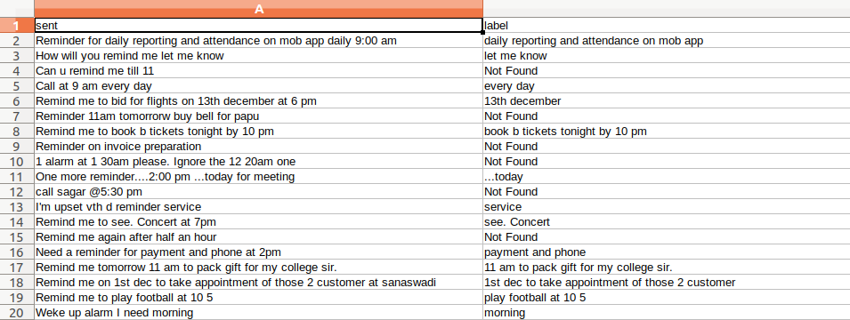
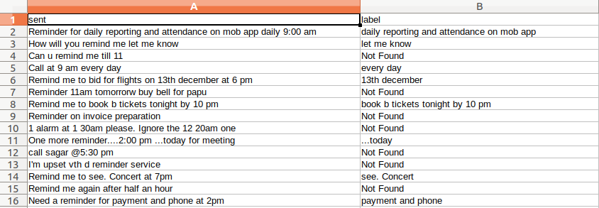

# Phrase Extractor
This is a project on Natural Language processing course where a given training text file with phrases are provided with which model is trained and evaluated. Later the trained model is used to predict the phrases for the test file

### The Files present in the project

<ul>
    <a href="https://github.com/varunreddy24/phrase_extractor/blob/master/eval_data.txt" target="_blank"><li>Eval Data.txt</li></a>
    <a href="https://github.com/varunreddy24/phrase_extractor/blob/master/training_data.tsv"><li>training data</li></a>
    <a href="https://github.com/varunreddy24/phrase_extractor/blob/master/regex_generator.py"><li>Regex generator</li></a>
    <a href="https://github.com/varunreddy24/phrase_extractor/blob/master/training_classifier.py"><li>Training Classifier</li></a>
    <a href="https://github.com/varunreddy24/phrase_extractor/blob/master/script.ipynb"><li>Main Script</li></a>
</ul>

### Required modules
* [Numpy](https://docs.scipy.org/doc/)
* [Sklearn](https://scikit-learn.org/stable/tutorial/basic/tutorial.html)
* [Pandas](http://pandas.pydata.org/pandas-docs/stable/)
* [Pickle](https://docs.python.org/3/library/pickle.html)
* [Nltk](https://www.nltk.org/)
* [Collections](https://docs.python.org/2/library/collections.html)

## Basic Methodology
The given eval_data.txt is fed to regex_generator.py, it generates a regex pattern file with one word previous and after of the label 
then the other pattern is with two words before the label.
Then the input data is fed to SVM architecture and MLP with 100 layers that trains the model which gives us two classes
<ul>
<li>Found</li>
<li>Not Found</li>
</ul>
Then test data is fed to the trained models to predict the classes weather the phrases are found or not,
if the phrases are found then the regex pattern is used to detect the phrase 

## Dataset

<table style="width:100%">
    <tr>
        <th>Index</th>
        <th>Sent</th>
        <th>Label</th>
    </tr>
    <tr>
        <td>1</td>
        <td>Can u pls remind me at 7pm on 8 Jan</td>
        <td>on 8th jan</td>
    </tr>
    <tr>
        <td>2</td>
        <td>Remind me to buy eggs on next Monday and Tuesday at 9pm</td>
        <td>buy eggs</td>
    </tr>
    <tr>
        <td>3</td>
        <td>Can you please remind me to fill a file at 9 pm today</td>
        <td> fill a file</td>
    </tr>
    <tr>
        <td>4</td>
        <td>I need a reminder. Every day. At 2.30 pm and 5.30 pm to message my wife.</td>
        <td>message my wife</td>
    </tr>
    <tr>
        <td>5</td>
        <td>Remind me at 11</td>
        <td>Not Found</td>
    </tr>
</table>


## Code Snippets

#### The Pattern Checking( word before and after the label if found)
```python
sub = '(\w*)\W*('+label+')\W*(\w*)'
sub = '(\w*)\W*(\w*)\W*('+label+')'
```
#### Regex Pattern Genrated
```python
...
...
m = re.search(' to (.+?) at ', text)
if m:
    found = m.group(1)
    small_master_list.append(found)
    
m = re.search(' to (.+?) on ', text)
if m:
    found = m.group(1)
    small_master_list.append(found)
m = re.search(' to (.+?) tomorrow ', text)
...
...
```

#### Training the algorithm
```python
clf = svm.LinearSVC(loss='hinge').fit(X_train_tfidf, y_train)
mlp = MLPClassifier(activation='relu', solver='lbfgs').fit(X_train_tfidf, y_train)
```
#### Accuracy obtained using the model
```
Accuracy with SVM is :0.868020304568528
Accuracy score with Multi Layer Perceptron: 0.8477157360406091
```

## Output obtained
<div>
    
    
</div>

---

## Project Contributuors

* [Varun Reddy](https://www.github.com/varunreddy24)
* [Aditya Ranjan](https://www.github.com/adityaranjan8)
* [Apoorv Tyagi](https://www.github.com/apoorvtyagi)
